# Developer Guide <!-- omit in toc -->

## Table of Contents <!-- omit in toc -->
- [Introduction](#introduction)
  - [Purpose of This Guide](#purpose-of-this-guide)
  - [Developer Guide Usage](#developer-guide-usage)
- [Acknowledgements](#acknowledgements)
- [Terminologies](#terminologies)
- [Symbols](#symbols)
- [Getting Started](#getting-started)
  - [Setting Up the Project](#setting-up-the-project)
  - [Additional Considerations](#additional-considerations)
- [Design](#design)
  - [Architecture](#architecture)
  - [UI Component](#ui-component)
  - [Logic Component](#logic-component)
  - [Data Component](#data-component)
  - [Module Component](#module-component)
  - [Recipe Component](#recipe-component)
  - [Storage Component](#storage-component)
- [Implementation](#implementation)
  - [Decodex Initialisation](#decodex-initialisation)
  - [Decodex Main Logic](#decodex-main-logic)
  - [Parser - Basic Command Logic](#parser---basic-command-logic)
  - [Parser - Recipe Command Logic](#parser---recipe-command-logic)
  - [Modules](#modules)
    - [Implemented Modules:](#implemented-modules)
  - [List of Commands](#list-of-commands)
    - [HelpCommand](#helpcommand)
    - [InputCommand](#inputcommand)
    - [ShowCommand](#showcommand)
    - [ExitCommand](#exitcommand)
    - [ResetCommand](#resetcommand)
    - [SelectCommand](#selectcommand)
      - [SelectCommand (Module)](#selectcommand-module)
      - [SelectCommand (Recipe)](#selectcommand-recipe)
    - [ListCommand](#listcommand)
  - [Recipe Commands](#recipe-commands)
    - [RecipeNewCommand](#recipenewcommand)
    - [RecipeSelectCommand](#recipeselectcommand)
    - [RecipeDeselectCommand](#recipedeselectcommand)
    - [RecipeListCommand](#recipelistcommand)
    - [RecipePushCommand](#recipepushcommand)
    - [RecipePopCommand](#recipepopcommand)
    - [RecipeResetCommand](#reciperesetcommand)
    - [RecipeDeleteCommand](#recipedeletecommand)
- [Appendix A: Product Scope](#appendix-a-product-scope)
  - [Target User Profile](#target-user-profile)
  - [Value Proposition](#value-proposition)
- [Appendix B: User Stories](#appendix-b-user-stories)
- [Appendix C: Non-Functional Requirements](#appendix-c-non-functional-requirements)
- [Appendix D: Glossary](#appendix-d-glossary)
- [Appendix E: Instructions for Manual Testing](#appendix-e-instructions-for-manual-testing)
  - [Start and Shutdown](#start-and-shutdown)
  - [Inputting Data](#inputting-data)
  - [Listing Modules and Recipes](#listing-modules-and-recipes)
  - [Running Modules and Resetting](#running-modules-and-resetting)
  - [Listing Modules in Recipes](#listing-modules-in-recipes)
  - [Creating Recipes](#creating-recipes)
  - [Switching Recipes for Modification](#switching-recipes-for-modification)
  - [Modifying Recipes](#modifying-recipes)
  - [Running Recipes](#running-recipes)
  - [Deleting Recipes](#deleting-recipes)
  - [Storage of Recipe Files](#storage-of-recipe-files)
- [Appendix F - Examples of Saved Recipe Files](#appendix-f---examples-of-saved-recipe-files)

<div style="page-break-after: always;"></div>

## Introduction

Decodex is a **Command Line Interface (CLI) application for Capture-The-Flag (CTF) players to perform [encoding](#terminologies), [decoding](#terminologies), [encryption](#terminologies) and [decryption](#terminologies) of data**, which come in the form of [modules](#terminologies) that can be **executed with ease** and **without any programming** needed. Decodex also provides [recipes](#terminologies) that can also be used to link several of these [modules](#terminologies) together so that they could be executed in one go to speed up repetitive tasks. The intuitive interaction can thus help to speed up a player’s performance during CTFs and save time without having to manually code the tedious [data transformations](#terminologies).

### Purpose of This Guide

The purpose of this guide is to provide more information on our application, Decodex, such as the overall architecture, implementation and design rationales to developers who wish to contribute and enhance Decodex to it's fullest potential. As of the release of this developer guide, it is written for Decodex V2.1.

> :information_source: This guide may also serve as a start for software testers to find bugs and possibly edge cases within our applications.

### Developer Guide Usage

To better understand this developer guide, it is recommended to start off from the [Architecture](#architecture) section to have a high-level view of the application, before diving into each of the specific components to understand Decodex's design and implementation.

## Acknowledgements

1. SE-EDU
    1. [AB3 Developer Guide Format](https://se-education.org/addressbook-level3/DeveloperGuide.html)
    2. [AB3 User Guide Format](https://se-education.org/addressbook-level3/UserGuide.html)
    3. [AB3 Setting up and getting started page and related links](https://se-education.org/addressbook-level3/SettingUp.html)
    4. [AB3 Appendix: Requirements](https://se-education.org/addressbook-level3/DeveloperGuide.html#appendix-requirements)
    5. [AB2 Code Structure](https://github.com/se-edu/addressbook-level2)
2. [AY2021S2-CS2113-T10-1's Developer Guide](https://ay2021s2-cs2113-t10-1.github.io/tp/DeveloperGuide.html)

<div style="page-break-after: always;"></div>

## Terminologies

| Terminology                 | Definition                                                                                                                                                    |
| --------------------------- | ------------------------------------------------------------------------------------------------------------------------------------------------------------- |
| Data transformation         | The conversion of one data format to another.                                                                                                                 |
| Application, Program        | Refers to the `Decodex` program. These two terms are used interchangeably in this Developer Guide.                                                                   |
| Encoding                    | Convert a message into a coded form.                                                                                                                          |
| Decoding                    | Convert a coded message into an intelligible form                                                                                                             |
| Encryption                  | Conversion of a message into a form where only authorized parties are able to decipher it.                                                                       |
| Decryption                  | Conversion of an encrypted message back to its original form by deciphering it.                                                                                  |
| Base64, Binary, Hexadecimal | Common types of data encoding standards.                                                                                                                      |
| Console                     | This refers to your command prompt window.                                                                                                                    |
| Argument                    | The additional information you provide to the program's command.                                                                                              |
| Module                      | A self-contained set of instructions to process your data into another form.                                                                                  |
| Recipe                      | Acts as a container for you to select your modules. When multiple modules are selected, this forms a "module chain". By default, you do not have any recipes. |
| XYZ                         | Represents a wildcard of the specific mentioned. eg. `XYZCommand` can be `SelectCommand`, `ListCommand` etc.                                                  |
| Suffix                      | Something that comes at the end. <br>e.g. For for text files like `recipe.txt` then `.txt` is the suffix.                                                     |

<div style="page-break-after: always;"></div>

## Symbols

| Name                 | Definition                                                                                            |
| -------------------- | ----------------------------------------------------------------------------------------------------- |
| :bulb:               | Represents a good tip for you.                                                                        |
| :exclamation:        | Represents something important that you should take note of.                                          |
| :information_source: | Represents additional information regarding commands/features for you better understand how it works. |
| :pen:                | Represents our rationale behind the design/implementation.                                            |

## Getting Started

### Setting Up the Project

1. Forking and cloning
    1. **Fork** our repository.
    2. Then, **clone** the fork onto your computer.

    > 💡 For convenience, our repository can be found [here](https://github.com/AY2122S1-CS2113T-T10-3/tp).

2. Editor
    1. We highly recommend using Intellij IDEA, which can be downloaded from [here](https://www.jetbrains.com/idea/).
    2. However, you may still use other editors that you prefer. Just take note that most of our set ups are centered around Intellij.
3. Configure JDK
    1. Follow the guide at *[[se-edu/guides] IDEA: Configuring the JDK](https://se-education.org/guides/tutorials/intellijJdk.html)* to ensure Intellij is configured to use **JDK 11**, since our application runs on `Java 11`.
4. Importing project
    1. Follow the guide at *[[se-edu/guides] IDEA: Importing a Gradle project](https://se-education.org/guides/tutorials/intellijImportGradleProject.html)* to import the forked project into Intellij.

    > :exclamation: Note: Importing a Gradle project is slightly different from importing a normal Java project.

5. Verifying setup
    1. Run the `decodex.Decodex.java` and try a few commands.
    2. [Run the tests](https://se-education.org/addressbook-level3/Testing.html) to ensure they all pass.

<div style="page-break-after: always;"></div>

### Additional Considerations

1. Configure the coding style
    1. If using IDEA, follow the guide [[se-edu/guides] IDEA: Configuring the code style](https://se-education.org/guides/tutorials/intellijCodeStyle.html) to set up IDEA’s coding style to match ours.
   > 💡 Tip: Optionally, you can follow the guide [[se-edu/guides] Using Checkstyle](https://se-education.org/guides/tutorials/checkstyle.html) to find how to use the CheckStyle within IDEA e.g., to report problems as you write code.
2. Set up CI
    1. This project comes with a GitHub Actions config files (in `.github/workflows` folder). When GitHub detects those files, it will run the CI for your project automatically at each push to the `master` branch or to any PR. No set up required.
3. About our code structure
    1. OOP standardized
    2. Modularized.
        1. Any changes/additions to the current commands would simply require the changes within `Parser.java`.
        2. For any changes/additions to the modules, would simply require changes within the `src/main/java/decodex/modules` folder.
    3. This structure makes it easier for us as well as developers like you to maintain and further extend the capabilities of our application.

> :exclamation: Before continuing to the Design and Implementation sections, please note that "XYZ" represents a wildcard that is used to mention commands and modules. eg. `XYZCommand` refers to `SelectCommand`, `ListCommand` etc, and `XYZModule` refers to `Base64Encoder`, `HexDecoder`, etc.

<div style="page-break-after: always;"></div>

## Design

### Architecture

The ***Architecture Diagram*** given below shows the high-level design of Decodex.


**Main Components of The Architecture**

`Decodex` is responsible for initialising the components at launch.

The rest of the program consists of 6 other components:

- `UI`: Handles user input and message output to the console
- `Logic`: Parses user input and executes commands
- `Recipe`: Manages a sequence of module to be executed
- `Module`: Manages a set of encoding and decoding processes
- `Data`: Holds the data that is to be encoded or decoded
- `Storage`: Manages the reading and writing of data to disk

<div style="page-break-after: always;"></div>

### UI Component


The `Ui` component consists of:

- `Ui`: Manages access to the `Scanner` object that reads user input and also contains all the methods for printing to the user.

### Logic Component

Below is a partial class diagram that shows an overview of the `Logic` component.


<div style="page-break-after: always;"></div>

The `Logic` component consists of:

- `Parser`: Handles user input and decides the `XYZCommand` object to create.
- `RecipeCommandParser`: When `Parser` detects that a `RecipeXYZCommand` object needs to be created, the user input is handed over from `Parser` and `RecipeCommandParser` will decide the `RecipeXYZCommand` object to create.
- `Command`: An abstract class that defines the blueprint for the derived `XYZCommand` and `RecipeXYZCommand` classes. <a name="designListOfCommands"></a>
    - `InputCommand`: Takes in a string from the user and sets it as the current `Data` object to perform operations on.
    - `ShowCommand`: Shows the current Data object.
    - `HelpCommand`: Displays all command syntaxes to the user.
    - `ListCommand`: Displays all `Module` objects and loaded `Recipe` objects to the user.
    - `SelectCommand`: Executes a supported `Module` object or a loaded `Recipe` object on the current `Data` object and replaces it with the resulting `Data` object from the execution.
    - `ResetCommand`: Reverts the current `Data` object to a state before any modules/recipes were executed on it.
    - `ExitCommand`: Exits the application.
    - `RecipeNewCommand`: Creates a new `Recipe` object with name provided by the user and creates a save file for it on the file system.
    - `RecipeSelectCommand`: Set a `Recipe` object as the recipe that is currently being edited.
    - `RecipeDeselectCommand`: Set the currently edited `Recipe` object as no longer being edited.
    - `RecipeListCommand`: Display all `Module` objects in a `Recipe` object.
    - `RecipePushCommand`: Appends a `Module` object to the `Recipe` object that is currently being edited.
    - `RecipePopCommand`: Removes the latest `Module` object from the `Recipe` object that is currently being edited.
    - `RecipeResetCommand`: Removes all `Module` objects from the `Recipe` object that is currently being edited.
    - `RecipeDeleteCommand`: Deletes a `Recipe` object from the application as well as its corresponding save file on the file system.


Below is the class diagram showing the association between the `Decodex` class and the `Parser` class.


Below is the class diagram showing the association between the abstract `Command` class and its `XYZCommand` and `RecipeXYZCommand` classes mentioned [earlier](#designListOfCommands).

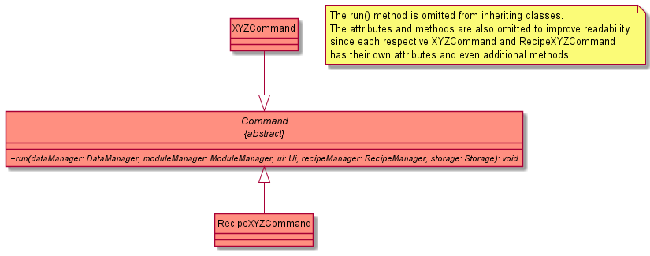

### Data Component

Below is a partial class diagram that shows an overview of the `Data` component.


The `Data` component consists of:

1. `Data`: Used to hold the bytes which the data transformations will act on.
2. `DataManager`: Holds a reference to the current `Data` object and updates it when a `Module` or `Recipe` is executed.

Below is the class diagram showing the association between the `Decodex` class, the `DataManager` class and the `Data` class.


<div style="page-break-after: always;"></div>

### Module Component

Below is a partial class diagram that shows an overview of the `Module` component.

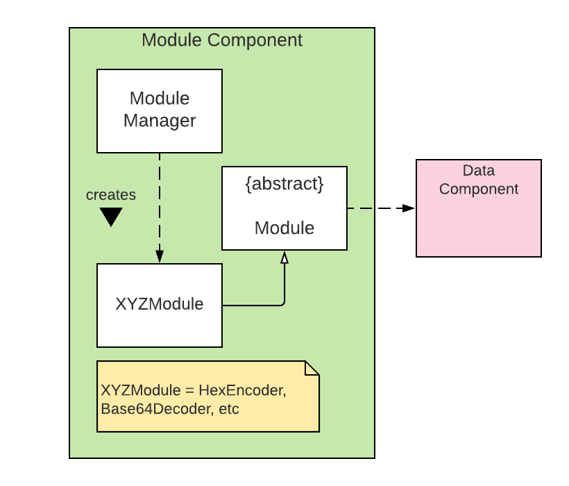

The `Module` component consists of:

- `Module`: An abstract class that defines the blueprint for the derived `XYZModule` classes.
    - `Base64Encoder`, `Base64Decoder`: Performs base64 encoding/decoding operations
    - `HexEncoder`, `HexDecoder`: Performs hexadecimal encoding/decoding operations
    - `BinaryEncoder`, `BinaryDecoder`: Performs binary encoding/decoding operations
    - `RotEncoder`: Performs rotational cipher operation
- `ModuleManager`: Decides and generates the necessary `Module` objects to be added to `Recipe` objects or to be executed on `Data` objects.

<div style="page-break-after: always;"></div>

Below is the class diagram showing the association between the `Decodex` class, the `ModuleManager` class.


Below is the class diagram showing the association between the abstract `Module` class and its derived `XYZModule` classes.

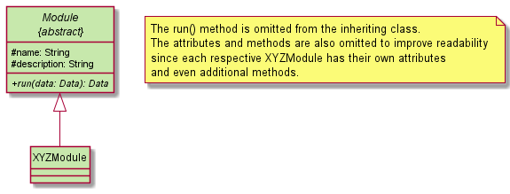

<div style="page-break-after: always;"></div>

### Recipe Component

Below is a partial class diagram that shows an overview of the `Recipe` component.


The `Recipe` component consists of:

- `Recipe`: Holds a chain of `Module` objects that, when ran, will execute sequentially on a `Data` object.
- `RecipeManager`: Manages all loaded `Recipe` objects and holds a reference to the `Recipe` object that is currently being edited.


> :pen: The reason for having `Recipe` objects is to enable users to run multiple modules at one go sequentially.

### Storage Component


The `Storage` component consists of:

- `Storage` : Performs all file related operations such as reading/saving to files and deleting of files.

To add on, the `Storage` component is designed to access only the following folders:

1. `recipe/` : For recipe files.

> :pen: The rationale behind standardizing a specific folder to read/save to, is to ensure that all relevant files can be found in the same location, which makes it easier for users to find the files they are looking for.

<div style="page-break-after: always;"></div>

## Implementation

This section focuses on explaining the specific application flows and the interactions between the classes and their methods.

:exclamation: The lifeline of the objects should terminate at the destroy marker (`X`), however due to a limitation of the PlantUML software, the lifeline extends beyond the destroy marker.

### Decodex Initialisation

Below shows the sequence diagram of the initialisation of Decodex.

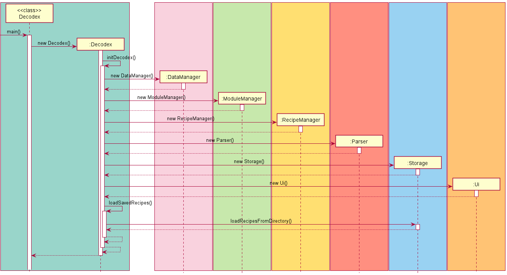

During the initialisation sequence of Decodex, all the dependencies (i.e `DataManager`, `ModuleManager` .etc) are instantiated, which will later on be passed to the relevant commands and methods for usage.

<div style="page-break-after: always;"></div>

### Decodex Main Logic

Below is the sequence diagram showing the overall flow of Decodex.

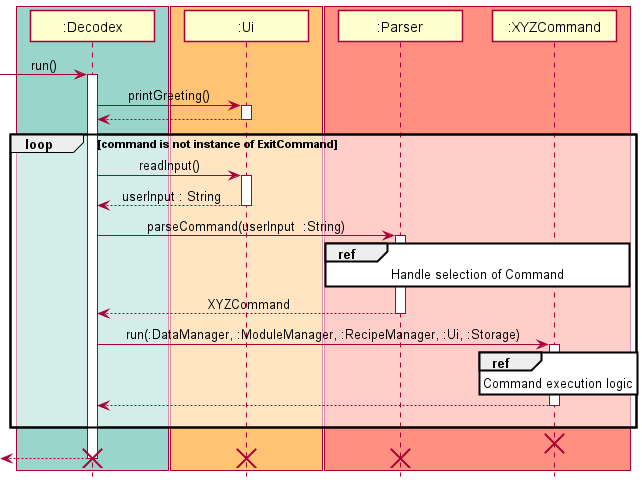

This main logic occurs after the initialisation sequence in the previous figure. It comprises of the main loop that provides the interactivity to the user by reading input from them and attempting to execute it as a command. The loop terminates when the user enters the `exit` command.

<div style="page-break-after: always;"></div>

### Parser - Basic Command Logic

Below is the sequence diagram that shows the overall flow of the `Parser` logic.

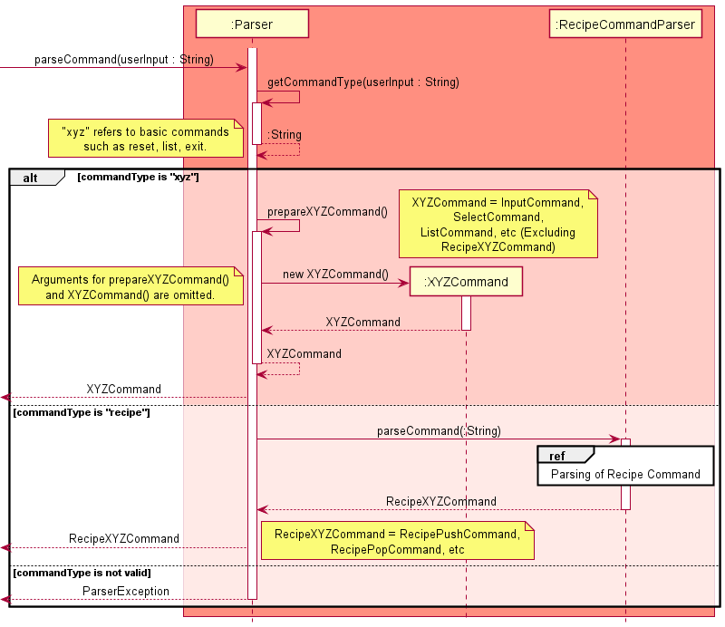

The flow of the `Parser` logic:

1. Receives the user input and parses it to get the command type.
2. Prepares the corresponding `XYZCommand`.
    1. However, if the command is a `RecipeXYZCommand`, it will be passed to `RecipeCommandParser` for subcommand parsing.
3. Returns the `Command` object back to `Decodex`.

<div style="page-break-after: always;"></div>

### Parser - Recipe Command Logic

Below is the sequence diagram that shows the overall flow of the `RecipeCommandParser` logic.

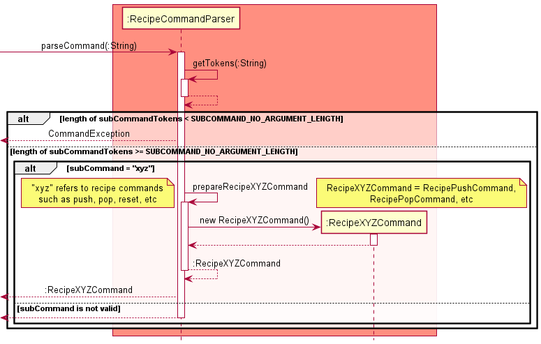

The general process of the `RecipeCommandParser` logic consists of:

1. Receives the user input from `Parser` then parses it to get the subcommand type.
2. Prepares the corresponding `RecipeXYZCommand`
3. Returns the `RecipeXYZCommand` object back to `Decodex`.

<div style="page-break-after: always;"></div>

### Modules

The abstract `Module` class serves as the base class for all modules to be inherited from. It contains essential information that must be present in every module developed for Decodex.

- `name`: The name of the module
- `description`: The description of the module
- `run(Data data)`: The abstract method to process the provided `Data`

The `name` and `description` variables must be set during the instantiation of the module, that is to say in the constructor.

The abstract `run(Data data)` method should be implemented to access the bytes inside the given `Data` object, perform some processing on them, construct a new `Data` object from the results and return it.
There are two groups of modules supported by Decodex:

- Modules that do not take in any parameters
- Modules that take in at least one parameter

**Modules that do not take in any parameters**

This group of modules do not require any additional parameters as their encoding and decoding processes are fixed. Hence, the constructors of these modules should not receive any parameters.

**Modules that take in at least one parameter**

This group of modules require at least one additional parameter as their encoding and decoding processes are dependent on the provided parameters. The constructors of these modules should receive parameters as required and stored in private variables. These variables will then be used in their respective `run(Data data)` method.

The current implementation of the abstract `Module` class provides a strong foundation to be inherited by much more complex modules, and developed into full-functioning modules for Decodex.

<div style="page-break-after: always;"></div>

#### Implemented Modules:

| No Parameters                                                                                | At Least One Parameter |
| -------------------------------------------------------------------------------------------- | ---------------------- |
| `Base64Encoder` <br> `Base64Decoder` <br> `HexEncoder` <br> `HexDecoder` <br> `BinaryEncoder` <br> `BinaryDecoder` | `RotEncoder`             |

### List of Commands

> :information_source: For the following sequence diagrams for XYZCommands, the parameters in the run() method is omitted to improve readability.

#### HelpCommand

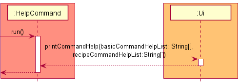

When the `Parser` recognises the `help` keyword from the user input, a `HelpCommand` is instantiated.

1. Prints out the list of all available command (`XYZCommand` and `RecipeXYZCommand`) syntaxes, and their corresponding descriptions.

<div style="page-break-after: always;"></div>

#### InputCommand

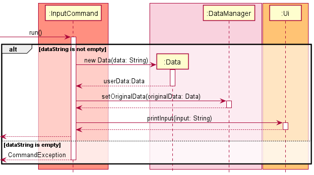

When the `Parser` recognises the `input` keyword from the user input, an `InputCommand` is instantiated.

1. Create a `Data` object from the user input.
2. Set the created `Data` object as the `originalData` in the `DataManager` .
3. Prints the provided user input back to the console.

#### ShowCommand


When the `Parser` recognises the `show` keyword from the user input, an `ShowCommand` is instantiated.

1. Gets the current `Data` object stored in DataManager.
2. Prints the current data to the console.

#### ExitCommand

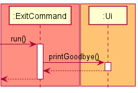

When the `Parser` recognises the `exit` keyword from the user input, an `ExitCommand` is instantiated.

1. Prints the goodbye message to the console.

#### ResetCommand

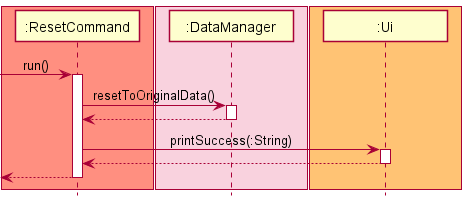

When the `Parser` recognises the `reset` keyword from the user input, a `ResetCommand` is instantiated.

1. Replace the contents of `currentData` in `DataManager` with that of `originalData`.
2. Prints a successful reset message to the console.

<div style="page-break-after: always;"></div>

#### SelectCommand


When the `Parser` recognises the `select` keyword from the user input, a `SelectCommand` is instantiated.

1. If `selectCategory` is
    1. `module`, the selected `Module` is retrieved and executed on the provided `Data`. See [SelectCommand (Module)](#selectcommand-module) for the full sequence diagram.
    2. `recipe`, the selected `Recipe` is retrieved and its `Module`objects are executed on the provided `Data`. See [SelectCommand (Recipe)](#selectcommand-recipe) for the full sequence diagram.

<div style="page-break-after: always;"></div>

##### SelectCommand (Module)

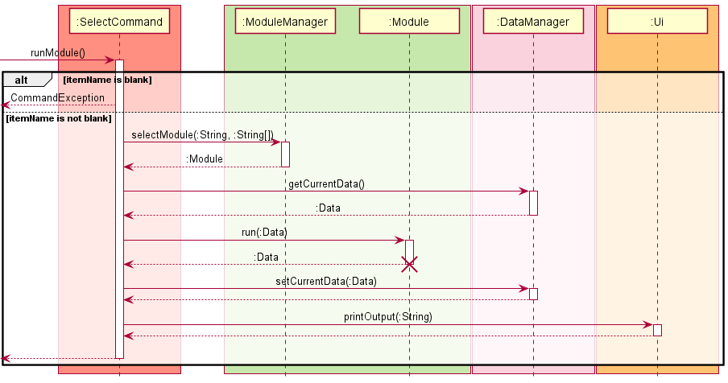

1. Retrieves the corresponding `Module` with the provided `itemName` and `parameters` from `ModuleManager`.
2. Retrieves the current `Data` object from `DataManager`.
3. Executes the selected `Module` on the retrieved `Data` object and stores the processed content in a new `Data` object.
4. Sets the new `Data` object as the current data in `DataManager`.
5. Prints the contents of the new `Data` object to the console.

<div style="page-break-after: always;"></div>

##### SelectCommand (Recipe)


1. Retrieves the corresponding Recipe with the provided `itemName` from `RecipeManager`.
2. Retrieves the current `Data` object from `DataManager`.
3. Executes the selected `Recipe` on the retrieved `Data` object and stores the processed content in a new `Data` object.
4. Sets the new `Data` object as the current data in `DataManager`.
5. Prints the `Module` objects in the executed `Recipe` to the console.
6. Prints the content of the new `Data` object to the console.

<div style="page-break-after: always;"></div>

#### ListCommand

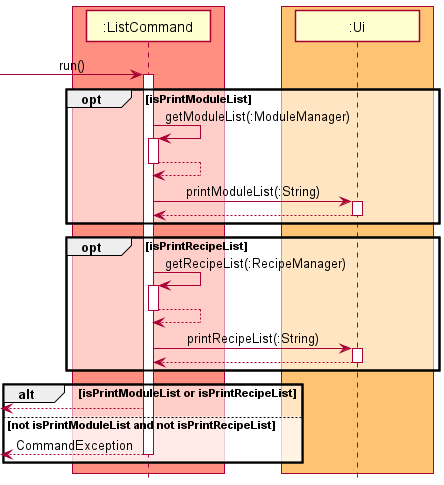

When the `Parser` recognises the `list` keyword from the user input, a `ListCommand` is instantiated.

The `ListCommand` would then parse any optional arguments, setting the `isPrintModuleList` and `isPrintRecipeList` boolean variables appropriately.

1. If `isPrintModuleList` is true
    1. Retrieves a list of all `Module` objects from `ModuleManager`. 
    2. Prints the retrieved list of `Module` objects to the console.
2. If `isPrintRecipeList` is true
    1. Retrieves a list of all `Recipe` objects from `RecipeManager`.
    2. Prints the retrieved list of `Recipe` objects to the console.

<div style="page-break-after: always;"></div>

### Recipe Commands

The following commands are specific to managing modules within recipes.

The command format begins with the command keyword `recipe`, followed by a subcommand keyword, and finally any arguments.

Format: `recipe <subcommand> {arguments}`

Example: `recipe new newRecipe`

#### RecipeNewCommand


When the `RecipeCommandParser` recognises the `new` subcommand keyword from the user input, a `RecipeNewCommand` is instantiated.

1. Creates a new `Recipe` object with the provided `recipeName`.
2. Add the newly created `Recipe` into the `RecipeManager`.
3. Sets `recipeName` as the `editingRecipeName` in `RecipeManager`.
4. Prints a successful creation message to the console.

<div style="page-break-after: always;"></div>

#### RecipeSelectCommand

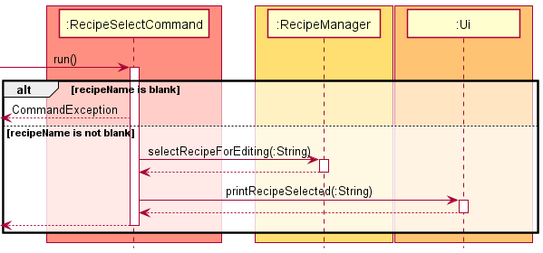

When the `RecipeCommandParser` recognises the `select` subcommand keyword from the user input, a `RecipeSelectCommand` is instantiated.

1. Retrieves the `Recipe` corresponding with the provided `recipeName` from `RecipeManager`.
2. Sets `recipeName` as the `editingRecipeName` in `RecipeManager`.
3. Prints a successful selection message containing the `recipeName` to the console.

#### RecipeDeselectCommand

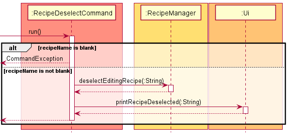

When the `RecipeCommandParser` recognises the `deselect` subcommand keyword from the user input, a `RecipeDeselectCommand` is instantiated.

1. Retrieves the `recipeName` of the `Recipe` corresponding to `editingRecipeName` in `RecipeManager`.
2. Sets the `editingRecipeName` in `RecipeManager` as `null`.
3. Prints a successful deselection message containing the `recipeName` to the console.

#### RecipeListCommand


When the `RecipeCommandParser` recognises the `list` subcommand keyword from the user input, a `RecipeListCommand` is instantiated.

1. If `recipeName` is
   1. blank, the `Recipe` with the current `editingRecipeName` is retrieved.
   2. not blank, the `Recipe` with `recipeName` is retrieved.
2. Retrieves the list of `Module` objects belonging to the `Recipe` with `recipeName`.
3. Prints the names and parameters of each `Module` object in the retrieved list.

<div style="page-break-after: always;"></div>

#### RecipePushCommand


When the `RecipeCommandParser` recognises the `push` subcommand keyword from the user input, a `RecipePushCommand` is instantiated.

1. Retrieves the corresponding `Module` with the provided `moduleName` and `parameters` from `ModuleManager`.
2. Retrieves the current editing `Recipe`.
3. Adds the retrieved `Module` into the current editing `Recipe`.
4. Prints the a message of the added `Module` to the console.

<div style="page-break-after: always;"></div>

#### RecipePopCommand

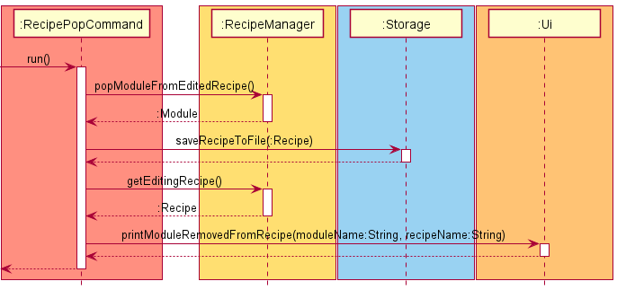

When the `RecipeCommandParser` recognises the `pop` subcommand keyword from the user input, a `RecipePopCommand` is instantiated.

1. Retrieves the latest `Module` added to the `Recipe`, and removes it from the `Recipe` after retrieval.
2. Retrieves the current editing `Recipe`.
3. Prints the a message of the removed `Module` to the console.

<div style="page-break-after: always;"></div>

#### RecipeResetCommand

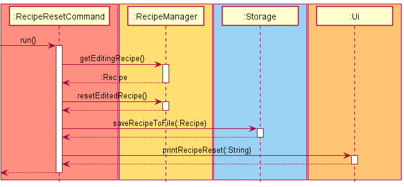

When the `RecipeCommandParser` recognises the `Reset` subcommand keyword from the user input, a `RecipeResetCommand` is instantiated.

1. Retrieves the `Recipe` with the current `editingRecipeName` is retrieved.
2. Removes all modules contained in the `Recipe`
3. Prints a successful reset message containing the `recipeName` to the console.

<div style="page-break-after: always;"></div>

#### RecipeDeleteCommand


When the `RecipeCommandParser` recognises the `delete` subcommand keyword from the user input, a `RecipeDeleteCommand` is instantiated.

1. Removes the `Recipe` with the `recipeName` from `RecipeManager`.
2. Prints `recipeName` as the deleted `Recipe` to the console.

<div style="page-break-after: always;"></div>

## Appendix A: Product Scope

### Target User Profile

1. Prefer using CLI over other types
2. Can type fast
3. Does Capture-the-flag (CTF) competitions
4. Requires to use multiple data manipulation techniques at once
5. Is comfortable with CLI
6. May be for both normal and expert users (in terms of technical capabilities)

### Value Proposition

This application helps users (mainly CTF players) to quickly transform data from one format to another (e.g., from plain text to base64-encoded text). It includes features such as the ability to perform basic data transformations with a few simple commands. Furthermore, it also includes the use of recipes to allow for multiple modules to be executed in sequence, which would be useful when multiple consecutive data transformations are needed.

To sum it up, this application helps users to reduce the time needed to transform data from one form to another, especially when consecutive data transformations are required.

<div style="page-break-after: always;"></div>

## Appendix B: User Stories

| version | priority | as a ...        | I want to...                                 | so that i can ...                                        |
| ------- | -------- | --------------- | -------------------------------------------- | -------------------------------------------------------- |
| V1.0    | ***      | user            | input data                                   | perform data manipulation on it                          |
| V1.0    | ***      | user            | see the output of my processed data          | see the effects of the change                            |
| V1.0    | ***      | user            | view a list of modules                       | see what modules I can use on my data                    |
| V1.0    | ***      | user            | add a module                                 | decided to process data with the selected module         |
| V1.0    | ***      | user            | run a module                                 | process data with the selected module                    |
| V2.0    | ***      | user            | create a new recipe                          | create different combinations of module chains           |
| V2.0    | ***      | user            | view a list of modules while creating recipe | decide what modules to be added to the recipe            |
| V2.0    | ***      | user            | add a module to the recipe                   | use it process my data                                   |
| V1.0    | **       | user            | remove all modules in the recipe             | see my original input data                               |
| V2.0    | **       | expert user     | read input data from a file                  | process data that are not printable or terminal-friendly |
| V2.0    | **       | expert user     | edit the exported recipes                    | inspect and modify it in an editor                       |
| V2.0    | **       | user            | see the list of the commands                 | know what commands I can use                             |
| V2.0    | **       | user            | see the syntax of the commands               | know how to use the commands                             |
| V2.0    | **       | CTF Participant | save my decoded output                       | reuse the output later                                   |
| V2.0    | **       | user            | import recipes from a file                   | I do not have to create the recipe from scratch/manually |
| V2.0    | **       | user            | save my recipes to a file                    | I can reuse the recipe on a different computer           |
| V2.0    | **       | user            | list the recipes I have                      | use them again                                           |

## Appendix C: Non-Functional Requirements

1. Should work on any *mainstream OS* as long as it has Java `11` or above installed.
2. Should be able to have up to 20 recipes without any impact on the performance.
3. A CTF participant should be able to work more efficiently on their CTF challenges compared to manual scripting in terms of time.
4. A user should be able to comfortably use and understand the application if they are within the IT field.
5. A user with above average typing speed for regular English text (i.e. not code, not system admin commands) should be able to accomplish most of the tasks faster using commands than using the mouse.

<div style="page-break-after: always;"></div>

## Appendix D: Glossary

- **Mainstream OS**: Windows, Linux, Unix, OS-X

**Note:** These instructions only provide a starting point for testers to work on, testers are expected to do more *exploratory* testing.

## Appendix E: Instructions for Manual Testing

### Start and Shutdown

1. Ensure you have Java version `11` or above installed on your computer.
2. Next, download the latest `decodex.jar` [here](https://github.com/AY2122S1-CS2113T-T10-3/tp/releases).
3. Copy the `decodex.jar` into an empty folder.
4. Run the `decodex.jar` on your command prompt by typing in `java -jar decodex.jar` the press `Enter`.
5. Type a command in the command box after the `Decodex [] >` prompt and press Enter to execute it. e.g. typing `help` and pressing `Enter` will show a list available commands, their respective descriptions and syntaxes.
6. To exit Decodex, use the `exit` command. Alternatively, Decodex can be exited using `Ctrl+C` or by closing the command prompt window.

### Inputting Data

When entering data, `Decodex` requires a specific format such that the data is entered correctly.


> :information_source: Notes about the input data
> - The program will consider **all characters following the first space character as data** in the input command. You may observe leading and trailing whitespaces in the output.
>
> - **Non-printable characters** (e.g. null characters) may not be correctly displayed and could potentially scramble the user interface.
> 
> - There will only be one instance of data at any time. Running the `input` command will overwrite the current data that is stored in the program.


Here are some example inputs you can try:
- `input hello world` : Inputs "hello world" as data into the Decodex.
- `input <space>hello world<space>` : Inputs "<space>hello world<space>" as data into Decodex.
- `input goodbye world` : Inputs "goodbye world" as data into the Decodex.

For subsequent examples below, this guide assumes that the original input data is `goodbye world`.

### Listing Modules and Recipes

The `list` command has 3 variations:

- List all modules and recipes
- List all modules
- List all recipes

The first command lists every single modules and recipes which is the combined output of the other 2 commands. No recipes will be found if no recipes have been created.

- Test case `list`
  - Expected (if no recipes exists):

```
Here is the list of supported modules:
  base64encode - Encodes the data using Base64 format.
  base64decode - Decodes the data using Base64 format.
  hexencode    - Converts the input string to hexadecimal bytes.
  hexdecode    - Converts a hexadecimal string back into its raw value.
  binencode    - Encodes the data using binary format.
  bindecode    - Decodes the data using binary format.
  rotencode    - Rotates alphabetical characters by a specified integer offset.

You do not have any recipes
```
- Test case `list`
  - Expected (if some recipes exists):

```
Here is the list of supported modules:
  base64encode - Encodes the data using Base64 format.
  base64decode - Decodes the data using Base64 format.
  hexencode    - Converts the input string to hexadecimal bytes.
  hexdecode    - Converts a hexadecimal string back into its raw value.
  binencode    - Encodes the data using binary format.
  bindecode    - Decodes the data using binary format.
  rotencode    - Rotates alphabetical characters by a specified integer offset.

Here is the list of available recipes:
  myRecipe1
  myRecipe_123
```

<div style="page-break-after: always;"></div>

- Test case `list modules`
    - Expected:

```
Here is the list of supported modules:
  base64encode - Encodes the data using Base64 format.
  base64decode - Decodes the data using Base64 format.
  hexencode    - Converts the input string to hexadecimal bytes.
  hexdecode    - Converts a hexadecimal string back into its raw value.
  binencode    - Encodes the data using binary format.
  bindecode    - Decodes the data using binary format.
  rotencode    - Rotates alphabetical characters by a specified integer offset.
```

- Test case `list recipes`
    - Expected (if no recipes exists):

```
You do not have any recipes
```

- Test case `list recipes`
    - Expected (if some recipes exists):

```
Here is the list of available recipes:
  myRecipe1
  myRecipe_123
```

### Running Modules and Resetting

Running the data through multiple modules and resetting it to its original data is shown below. Here, the current data refers to the output from the previous ran module and by default, if no modules is ran, then current data is the same as input data, i.e. `goodbye world`.

1. Following this order of execution:
    1. `select module hexencode` : Encodes the (original) data with Hexadecimal encoding.
    2. `select module base64encode` : Encodes the current data with Base64 encoding.
    3. `select module rotencode 5` : Encodes the current data by rotating the alphabetic characters by offset of +5.
    4. `select module binencode` : Encodes the current data with Binary encoding.
2. The resulting output would be something unintelligible.
3. In order to obtain the original data, running `reset` will return the current data back to the original data that was inputted. i.e. `goodbye world` .

<div style="page-break-after: always;"></div>

### Listing Modules in Recipes

List the module sequences in previously created recipes.

- Test case: `recipe list`
    - Expected (if a non-empty recipe was selected for editing):

```
Here is the list of modules in recipe myRecipe1:
  1. base64encode
  2. base64encode
  3. hexencode
```

- Test case: `recipe list`
  - Expected (if an empty recipe was selected for editing):

```
[x] There are no modules in the recipe
```

- Test case: `recipe list`
  - Expected (if no recipe was selected for editing):

```
[x] No recipe selected for editing.
```

- Test case: `recipe list <recipe name>` (i.e. `<recipe name>` is `recipe1`)
  - Expected (if recipe is not empty):

```
Here is the list of modules in recipe myRecipe1:
  1. base64encode
  2. base64encode
  3. hexencode
```

- Test case: `recipe list <recipe name>`
  - Expected (if recipe is empty):

```
[+] There are no modules in the recipe
```

<div style="page-break-after: always;"></div>

### Creating Recipes

Creating recipes can be done using the `recipe new` command.

An example of a valid recipe creation command is shown below.

- Test case: `recipe new special_Recipe1`
    - Expected:

```
[+] Recipe special_Recipe1 created successfully
```

Some examples of invalid recipe creation commands are shown below.

- Test case: `recipe new Invalid Recipe N@me!`
    - Expected:

```
[x] Too many command arguments
```

- Test case: `recipe new XÆA-12`
    - Expected:

```
[x] Recipe names can contain only alphabets, numbers and underscores and must be non-empty.
```

> :bulb: The expected output of the test case above might exceed an A4 page's width when viewing in PDF format or when printed. See the full output on the online developer guide [here](https://ay2122s1-cs2113t-t10-3.github.io/tp/DeveloperGuide.html#creating-recipes).

### Switching Recipes for Modification

Switching of recipes to modify them. Below shows an example of the switch from one recipe to another. The `recipe deselect` command is optional when switching between recipes.

Assuming there are 3 recipes `myRecipe1`, `myRecipe_123` and `special_Recipe1`.

- Test case: `recipe select myRecipe1`
    - Expected: Selects the recipe `myRecipe1` for editing.

```
[+] Recipe myRecipe selected for editing
Decodex [Editing: myRecipe] >
```

<div style="page-break-after: always;"></div>

- Test case: `recipe deselect`
    - Expected: deselects the recipe currently being edited

```
[+] Recipe myRecipe deselected
Decodex [] >
```

### Modifying Recipes

Modifies the sequence of modules in a recipe.

The following test cases should be run in sequence:

1. Test case: `recipe select special_Recipe1`. Select the recipe `special_Recipe1` for editing.
    1. Expected: The recipe `special_Recipe1` is selected for editing.

    ```
    [+] Recipe special_Recipe1 selected for editing
    Decodex [Editing: special_Recipe1] >
    ```
2. Test case: `recipe push hexencode`. Add the `hexencode` module to the recipe.
    1. Expected: The `hexencode` module is added to the recipe.

    ```
    [+] Added hexencode module to recipe special_Recipe1
    ```
3. Test case: `recipe push base64decode`. Add the `base64decode` module to the recipe.
    1. Expected: The `base64decode` module is added to the recipe.

    ```
    [+] Added base64decode module to recipe special_Recipe1
    ```

4. Test case: `recipe pop`. If adding the `base64decode` module was a mistake, remove it from the recipe.
    1. Expected: The `base64decode` module is removed from the recipe.

    ```
    [+] Removed base64decode module from recipe special_Recipe1
    ```

5. Test case: `recipe push base64encode`. The correct module `base64encode` is added to the recipe.
    1. Expected: The `base64encode` module is added to the recipe.

    ```
    [+] Added base64encode module to recipe special_Recipe1
    ```

6. Test case: `recipe push rotencode 5`. Add the `rotencode` module with argument `5` to the recipe.
    1. Expected: The `rotencode` module with argument `5` is added to the recipe.

    ```
    [+] Added rotencode module to recipe special_Recipe1
    ```

<div style="page-break-after: always;"></div>

### Running Recipes

Runs the modules in a recipe.

Assuming the input data is `hello world` and the previously created recipe `special_Recipe1` is available.

- Test case: `select recipe special_Recipe1`
    - Expected: The modules in `special_Recipe1` is run.

```
[+] Modules executed: hexencode, base64encode, rotencode 5
[+] Output: "Sol2SYEoSrR2EoNbSeh2EohdSrR2SF=="
```

### Deleting Recipes

Deleting a recipe.

- Test case: `recipe delete special_Recipe1`
  - Expected:
```
[+] Recipe special_Recipe1 has been deleted
```

<div style="page-break-after: always;"></div>

### Storage of Recipe Files

*Testing of invalid recipe files on startup*

All recipes are stored in their respective files with the name `recipeName.txt` in the `recipe/` directory where `recipeName` denotes their actual recipe name in Decodex. It is highly recommended to ensure that Decodex can access these files/directory to work properly.

Details of Recipe Files:

- If the `recipe/` directory does not exist yet (first time running it), Decodex will create it automatically.
- All recipe files are found in the `recipe/` directory and is loaded into Decodex on startup. Only valid recipe files (e.g. correct filetype and suffix of `.txt`) with the valid stored formats are loaded successfully into Decodex.
- Created automatically when a new recipe is created on Decodex is successfully created using `recipe new` command, but the contents of the corresponding recipe file will be empty.
- Updated automatically whenever a change (e.g. adding/removing modules) happens successfully in the respective recipe on Decodex.
- Deleted automatically whenever the corresponding recipe on Decodex is deleted successfully using `recipe delete`.
- The table below denotes the different behaviours on startup for an invalid `recipe/` directory and 2 invalid recipe files, assuming they are `myRecipe.txt` and `iRecipe.md`.

<div style="page-break-after: always;"></div>

| Invalid Type                                                                                                                                                                                                                  | Error Message                                                 | Behaviour                                                                                                                                                                                                                                                                                                                                                                                                                                                                                                           |
|-------------------------------------------------------------------------------------------------------------------------------------------------------------------------------------------------------------------------------|---------------------------------------------------------------|---------------------------------------------------------------------------------------------------------------------------------------------------------------------------------------------------------------------------------------------------------------------------------------------------------------------------------------------------------------------------------------------------------------------------------------------------------------------------------------------------------------------|
| Wrong `recipe` directory filetype -  the `recipe/` directory is actually a file.                                                                                                                                              | `[x] The recipe directory is not a valid directory`           | Decodex will try to look for files in the `recipe/` directory, but since it is not an actual directory, it flags to the user that it is not a valid directory. However, Decodex continues running, but users may choose to stop it to fix their directory. A simple fix would be to delete this invalid `recipe/`.                                                                                                                                                                                                  |
| Wrong recipe file filetype - `myRecipe.txt` is a directory instead.                                                                                                                                                           | No error messages.                                            | Decodex will try to load the contents of `myRecipe.txt` on startup, but since it is actually a directory, Decodex will treat  it as not a recipe file and ignore it.                                                                                                                                                                                                                                                                                                                                                |
| Wrong recipe file suffix - `iRecipe.md` is not of `.txt`.                                                                                                                                                                      | No error messages.                                            | Decodex will find that `iRecipe.md` is the `recipe/` directory, but it does not match the valid `.txt` suffix, so it simply ignores it. User can simply change the extension to `.txt` to fix it.                                                                                                                                                                                                                                                                                                                   |
| Wrong module syntaxes (e.g. If `rotencode` is missing an argument) - `myRecipe.txt` contains invalid module syntaxes.<br><br> For more information on what are some examples of valid/invalid syntaxes, please refer to [Appendix F](#appendix-f---examples-of-saved-recipe-files) | `[x] Failed to load following recipes into Decodex: myRecipe` | Decodex will try to load the contents of `myRecipe.txt` line by line to translate them into modules which are then loaded into the recipe called `myRecipe` in Decodex. Since, in this case, one of the module syntax is incorrect, the recipe fails to be loaded. If there are multiple recipe files that also failed to be loaded due to module syntaxes, then  they are appended in the error message. <br>To avoid this from happening, users are recommended to only use Decodex to make changes to these recipes. |

<div style="page-break-after: always;"></div>

## Appendix F - Examples of Saved Recipe Files

> :information_source: The modules in a recipe are stored in the recipe file in the format of `<moduleName> {moduleArgument}` where values in `<>` are compulsory while those in `{}` are optional.

**Below shows some of the case scenarios for valid and invalid module syntaxes in the saved recipe files.**

Sample of valid module syntaxes in a recipe file:

1. An example of the contents of a recipe file with valid module syntax on each line

```
    base64encode
    rotencode 13
    hexencode
```

Samples of invalid module syntaxes in a recipe file:

1. An example of the contents of a recipe file with invalid module argument.
    1. On line 2, an argument is expected for rotencode module, but it is missing.
```
    base64encode
    rotencode
    hexencode
```

2. An example of the contents of a recipe file with invalid module name.
    1. On line 1, the module name of "base64" does not exist/available on Decodex.
```
    base64
    rotencode 13
    hexencode
```
